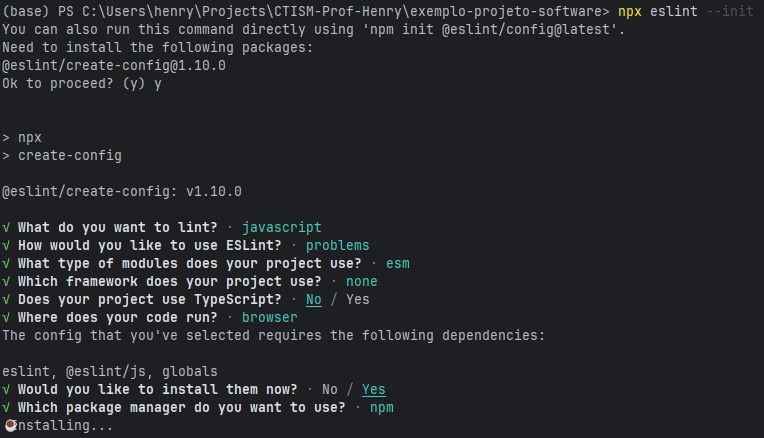

# Exemplo de projeto de software

Esse repositório apresenta um exemplo de projeto de software que segue todas as boas práticas da Engenharia de Software.

## Checklist

- [ ] Protótipo no Figma
- [x] Diagrama de classe
- [x] Diagrama de caso de uso
- [ ] Documentação no GitHub Pages com MKDocs
- [x] Testes unitários com QUnit
- [x] linter com ESLint 
- [x] Produto final (software)
- [ ] GitHub Action para rodar tudo automaticamente

## Pré-requisitos

Na data de escrita deste repositório, todos os requisitos são atendidos pelos computadores dos laboratórios:

* A documentação com MKDocs exige uma instalação Python 3.x na sua máquina, e a possibilidade de executar comandos 
  Python pelo terminal. Se precisar instalar, prefira a distribuição 
  [Python Anaconda](https://www.anaconda.com/download/success), e marque, no instalador, a opção de adicionar os 
  binários ao PATH do sistema:
  
* Os testes de software exigem node.js para execução e npm para instalação de pacotes, e, igualmente, adicionados ao
  PATH do sistema. Você pode baixá-los aqui: https://nodejs.org/pt/download

### Testando se os pré-requisitos estão instalados


## Diagramas

Disponíveis em [Diagramas](DIAGRAMAS.md)

## Instalação

### Para documentação

Abra a linha de comando **na pasta do projeto** (por exemplo, se você descompactou esse projeto em 
`C:\Users\henry\Downloads\exemplo-projeto-software`, certifique-se que é esse o caminho que aparece na linha de comando
) e digite estes comandos:

```bash
pip install -r requirements.txt 
mkdocs new .
```

Isso irá criar uma pasta `docs` e um arquivo `mkdocs.yml` na raiz do projeto.

Continue a partir do tutorial em https://github.com/CTISM-Prof-Henry/docsTutorial

### Para testes 

#### Instalando

```bash
npm install --save-dev qunit nyc
```

#### Usando

```bash
npm test
```

### Para linter

#### Instalando

```bash
npm install --save-dev eslint
npx eslint --init
```

Isso abrirá uma sequência de perguntas sobre o seu projeto:



#### Usando

```bash
npx eslint website/static/js/src
```