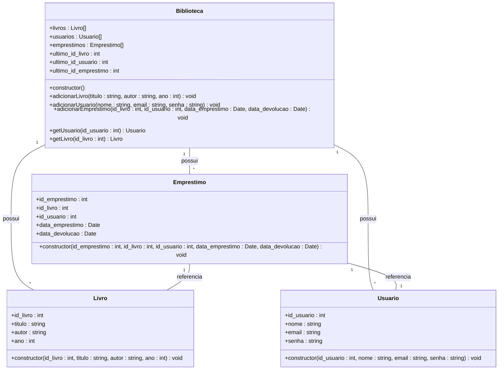
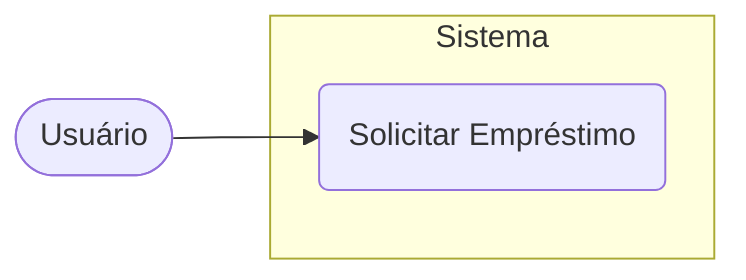

# Diagramas

Teste o código dos diagramas em [https://mermaid.live](https://mermaid.live)

## De classe

```mermaid
classDiagram
    class Livro {
        +id_livro : int
        +titulo : string
        +autor : string
        +ano : int
        +constructor(id_livro : int, titulo : string, autor : string, ano : int) void
    }

    class Usuario {
        +id_usuario : int
        +nome : string
        +email : string
        +senha : string
        +constructor(id_usuario : int, nome : string, email : string, senha : string) void
    }

    class Emprestimo {
        +id_emprestimo : int
        +id_livro : int
        +id_usuario : int
        +data_emprestimo : Date
        +data_devolucao : Date
        +constructor(id_emprestimo : int, id_livro : int, id_usuario : int, data_emprestimo : Date, data_devolucao : Date) void
    }

    class Biblioteca {
        +livros : Livro[]
        +usuarios : Usuario[]
        +emprestimos : Emprestimo[]
        +ultimo_id_livro : int
        +ultimo_id_usuario : int
        +ultimo_id_emprestimo : int
        +constructor()
        +adicionarLivro(titulo : string, autor : string, ano : int) void
        +adicionarUsuario(nome : string, email : string, senha : string) void
        +adicionarEmprestimo(id_livro : int, id_usuario : int, data_emprestimo : Date, data_devolucao : Date) void
        +getUsuario(id_usuario : int) Usuario
        +getLivro(id_livro : int) Livro
    }

    Biblioteca "1" -- "*" Livro : possui
    Biblioteca "1" -- "*" Usuario : possui
    Biblioteca "1" -- "*" Emprestimo : possui
    Emprestimo "1" -- "1" Livro : referencia
    Emprestimo "1" -- "1" Usuario : referencia
```

## De caso de uso

```mermaid
flowchart LR
    %% Atores
    Usuario([Usuário])

    %% Casos de uso
    subgraph "Sistema"
        SE(Solicitar Empréstimo)
    end

    Usuario --> SE
```