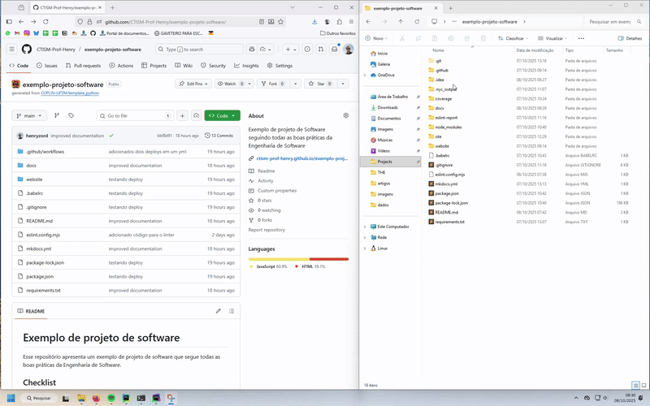
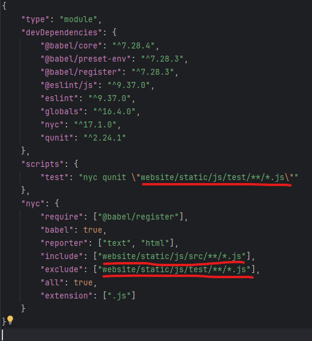

# Tutorial de Instalação e Configuração de site de Biblioteca

Este tutorial apresenta um passo-a-passo detalhado para instalar e configurar as ferramentas necessárias para trabalhar 
neste projeto, mesmo que você nunca tenha usado linha de comando ou precise de explicações bem detalhadas.

**⚠️ Importante:** nos computadores dos laboratórios, não é preciso baixar e configurar as ferramentas. Algumas delas
não estão inclusas no PATH do sistema; ou seja, você não conseguirá executar os comandos pela linha de comando. Porém,
se você localizar a pasta de instalação da biblioteca, e adicioná-la temporariamente ao PATH do sistema, irá funcionar!
Veja como abaixo:


## Pré-requisitos

### 1. Instalar o Python 3.x

1. Acesse o site do [Anaconda](https://www.anaconda.com/download/success).
2. Baixe a versão para o seu sistema operacional (Windows, Mac ou Linux).
3. Abra o instalador baixado.
4. Clique em "Next" (Próximo) até chegar na tela "Advanced Options" (Opções Avançadas).
5. Marque a opção **"Add Anaconda to my PATH environment variable"** (Adicionar Anaconda ao PATH do sistema). Isso é 
   importante!
   
6. Clique em "Install" (Instalar) e aguarde terminar.
7. Clique em "Finish" (Finalizar).

### 2. Instalar o Node.js e o npm

1. Acesse o site [https://nodejs.org/pt/download](https://nodejs.org/pt/download).
2. Baixe a versão recomendada para o seu sistema.
3. Abra o instalador baixado.
4. Clique em "Next" (Próximo) até o final, aceitando as opções padrão.
5. Certifique-se de que a opção "Add to PATH" está marcada (normalmente já está).
6. Clique em "Install" (Instalar) e depois em "Finish" (Finalizar).

### 3. Testando se está tudo instalado

1. No Windows, pressione as teclas **Windows + R** ao mesmo tempo.
2. Digite `cmd` e aperte Enter para abrir o terminal.
3. Digite `python --version` e aperte Enter. Deve aparecer algo como `Python 3.x.x`.
4. Digite `npm --version` e aperte Enter. Deve aparecer um número (ex: `10.2.0`).

Veja como deve aparecer:


Se aparecer erro, volte e confira se instalou corretamente e se marcou a opção de adicionar ao PATH. Lembre-se que você
pode exportar para o PATH temporariamente com o comando `set`, explicado acima.

## 4. Instalação da Documentação (MKDocs)

Para fazer a documentação, você precisa de:
* uma pasta `docs`, onde vários arquivos `.md` ficarão armazenados (um para cada página da documentação 
  * o mínimo é apenas um, de nome `index.md`
  * um arquivo `mkdocs.yml`, na pasta raiz do repositório
  * um arquivo `requirements.txt`, na pasta raiz do repositório

1. Abra o terminal (como explicado acima).
2. Acesse o link do seu trabalho no GitHub. Por exemplo, o link do repositório desse tutorial é 
   [https://github.com/CTISM-Prof-Henry/exemplo-projeto-software](https://github.com/CTISM-Prof-Henry/exemplo-projeto-software). 
   Acesse o link do **seu** trabalho
3. Baixe o zip do seu trabalho (botão Code > Download zip), ou então clone na sua máquina pela linha de comando
4. Descompacte o arquivo (não funciona com ele zipado!)
5. Navegue até a pasta do seu projeto, utilizando o comando `cd`, ou por outros métodos. Por exemplo, se você salvou o 
   projeto em `C:\Users\HenryCagnini\Projects\CTISM-Prof-Henry\exemplo-projeto-software`, certifique-se que é esse o 
   caminho que aparece na linha de comando:
6. Crie um arquivo `requirements.txt` e escreva isso dentro dele:
   ```text
   mkdocs
   mkdocs-material
   pygments
   ```
7. Digite o comando abaixo e aperte Enter:
   ```bash
   pip install -r requirements.txt
   ```
8. Para criar a estrutura inicial da documentação:
   ```bash
   python -m mkdocs new .
   ```
9. Escreva a documentação no arquivo `docs/index.md`. Essa é a parte do trabalho que deve ser feita.
10. Troque o código em `mkdocs.yml` para o código abaixo:
    ```yml
    site_name: Documentação trabalho
    theme: readthedocs
    markdown_extensions:
      - attr_list
      - footnotes
      - pymdownx.highlight:
          anchor_linenums: true
          line_spans: __span
          pygments_lang_class: true
      - pymdownx.inlinehilite
      - pymdownx.snippets
      - pymdownx.superfences
    ```
11. Crie uma pasta `.github`, e dentro dela uma pasta `workflows`. Dentro de `.github/workflows`, crie um arquivo 
    `documentation.yml`, e escreva isso dentro dele:
    ```yaml
    name: documentation.yml
    on:
      push:
        branches:
          - main
    jobs:
      docs:
        runs-on: ubuntu-latest
        permissions:
          contents: 'read'  # permite ler o conteúdo do repositório (necessário para clonar o código)
          pages: 'write'  # permite escrever no GitHub Pages
          id-token: 'write'  # permite autenticação OIDC (usada internamente pelo GitHub Actions para autorizar o deploy
        steps:
          - name: Clona repositório no servidor remoto do GitHub
            uses: actions/checkout@v5
            
          - name: Configura o interpretador Python
            uses: actions/setup-python@v4
            with:
              python-version: '3.x'
              
          - name: Instala bibliotecas Python
            run: |
              python -m pip install --upgrade pip
              pip install --requirement requirements.txt
              
          - name: Constrói páginas HTML com MKDocs
            run: mkdocs build
            
          - name: Configura o GitHub Pages
            uses: actions/configure-pages@v3
            
          - name: Envia dados para o GitHub Pages
            uses: actions/upload-pages-artifact@v3
            with:
              path: 'site/'
              
          - name: Publica páginas HTML no GitHub Pages
            id: deployment
            uses: actions/deploy-pages@v4
            env:
              GITHUB_TOKEN: ${{ secrets.GITHUB_TOKEN }}
    ```
12. Envie os arquivos para o seu repositório, seja pela linha de comando, ou fazendo upload dos arquivos:
    

13. Para mais detalhes, siga o tutorial em: https://github.com/CTISM-Prof-Henry/mkdocsTutorial

## 5. Instalação e Uso dos Testes (QUnit + NYC)

Os testes de software em Javascript exigem uma organização de pastas para colocar os arquivos de teste. Neste projeto,
os arquivos de código-fonte do Javascript estão na pasta 
[website/static/js/src](https://github.com/CTISM-Prof-Henry/exemplo-projeto-software/tree/main/website/static/js/src), 
enquanto os testes estão na pasta [website/static/js/test](https://github.com/CTISM-Prof-Henry/exemplo-projeto-software/tree/main/website/static/js/test).

Tenha em mente que você precisará informar esses caminhos no arquivo [package.json](https://github.com/CTISM-Prof-Henry/exemplo-projeto-software/blob/main/package.json),
para que os testes sejam corretamente localizados pelo npm. O tutorial abaixo explica como fazer isso, mas você 
precisará fazer adaptações de acordo com a estrutura do seu projeto.

A biblioteca de testes em Javascript usada aqui **não tem suporte ao DOM (Document Object Manager)**. Portanto, eu 
separei o código-fonte em dois arquivos, [definitions.js](https://github.com/CTISM-Prof-Henry/exemplo-projeto-software/blob/main/website/static/js/src/definitions.js),
que possui código Javascript puro (e que pode ser testado), e [index.js](https://github.com/CTISM-Prof-Henry/exemplo-projeto-software/blob/main/website/static/js/src/index.js),
que possui código que o testador não consegue executar (por exemplo, `document.getElementById`).

Eu também criei um arquivo de testes de nome [definitions.test.js](https://github.com/CTISM-Prof-Henry/exemplo-projeto-software/blob/main/website/static/js/test/definitions.test.js).
Esse arquivo testa apenas as funcionalidades que estão presentes no arquivo [definitions.js](https://github.com/CTISM-Prof-Henry/exemplo-projeto-software/blob/main/website/static/js/src/definitions.js).

1. No terminal, já dentro da pasta do projeto, digite o seguinte comando para instalar a biblioteca de testes:
   ```bash
   npm install --save-dev qunit nyc
   ```
2. Isso irá gerar uma pasta, `node_modules`, e dois arquivos, `package.json` e `package-lock.json`. Abra o arquivo 
   `package.json` e escreva o seguinte:
   ```json
   {
       "type": "module",
       "devDependencies": {
           "@babel/core": "^7.28.4",
           "@babel/preset-env": "^7.28.3",
           "@babel/register": "^7.28.3",
           "@eslint/js": "^9.37.0",
           "eslint": "^9.37.0",
           "globals": "^16.4.0",
           "nyc": "^17.1.0",
           "qunit": "^2.24.1"
       },
       "scripts": {
           "test": "nyc qunit \"website/static/js/test/**/*.js\""
       },
       "nyc": {
           "require": ["@babel/register"],
           "babel": true,
           "reporter": ["text", "html"],
           "include": ["website/static/js/src/**/*.js"],
           "exclude": ["website/static/js/test/**/*.js"],
           "all": true,
           "extension": [".js"]
       }
   }
   ```
3. Repare no caminho dos arquivos! É isso que você precisará mudar para ficar de acordo com o **seu** projeto:
   
4. Depois de escrever os arquivos de teste, adaptar os caminhos em `package.json` e salvar, execute os testes com:
   ```bash
   npm test
   ```
   Isso gerará um relatório na linha de comando, e também arquivos html com os resultados.

Para mais detalhes, siga o tutorial em: https://github.com/CTISM-Prof-Henry/softwareTesting

## 6. Instalação e Uso do Linter (ESLint)

1. No terminal, e a partir da pasta do seu trabalho (como descrito anteriormente), digite:
   ```bash
   npm install --save-dev eslint
   npx eslint --init
   ```

2. O terminal vai fazer perguntas sobre o seu projeto. Use as setas do teclado para escolher as opções e aperte Enter. 
   Veja um exemplo de como será:
   

3. Para rodar o linter e verificar o código, digite (⚠️ atente-se para o caminho do código-fonte!)
   ```bash
   npx eslint website/static/js/src
   ```
4. Isso gerará um relatório na linha de comando com a qualidade do seu código. Corrija os erros para pontuar mais no 
   trabalho!

## 7. Dicas Gerais

- Sempre execute os comandos na raiz do projeto (a pasta principal do projeto).
- Se aparecer erro dizendo que o comando não foi encontrado, confira se instalou e adicionou ao PATH.
- Se não conseguir, peça ajuda!
- Consulte a documentação oficial das ferramentas para configurações avançadas.
